# 100 exercícios de lógica de programação com JavaScript

apostila pertence ao Prof. Gustavo Guanabara

- [PASSO 01 - SEQUÊNCIAS BÁSICAS (1 - 16)](#passo-01)
- [PASSO 02 - CONDIÇÕES BÁSICAS (17 - 25)](#passo-02)
- [PASSO 03 - CONDIÇÕES COMPOSTAS (26 - 37)](#passo-03)
- [PASSO 04 – REPETIÇÕES ENQUANTO (38 - 55)](#passo-04)
- [PASSO 05 – ENQUANTO COM FLAG (56 - 60)](#passo-05)
- [PASSO 06 – REPETIÇÃO COM FAÇA ENQUANTO (61 - 63)](#passo-06)
- [PASSO 07 – REPETIÇÃO COM PARA ( 64 - 70)](#passo-07)
- [PASSO 08 – VETORES (71 - 85)](#passo-08)
- [PASSO 09 – PROCEDIMENTOS (86 - 94)](#passo-09)
- [PASSO 10 – FUNÇÕES (95 - 100)](#passo-10)

## PASSO-01
#### 001

#### 002

#### 003
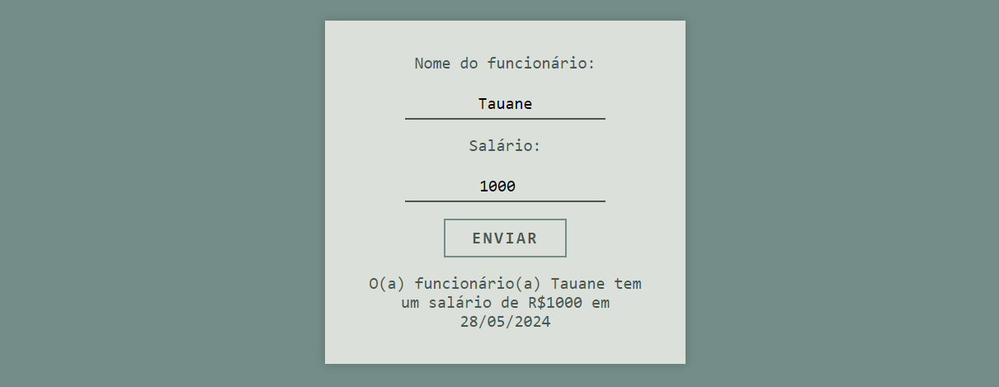
#### 004
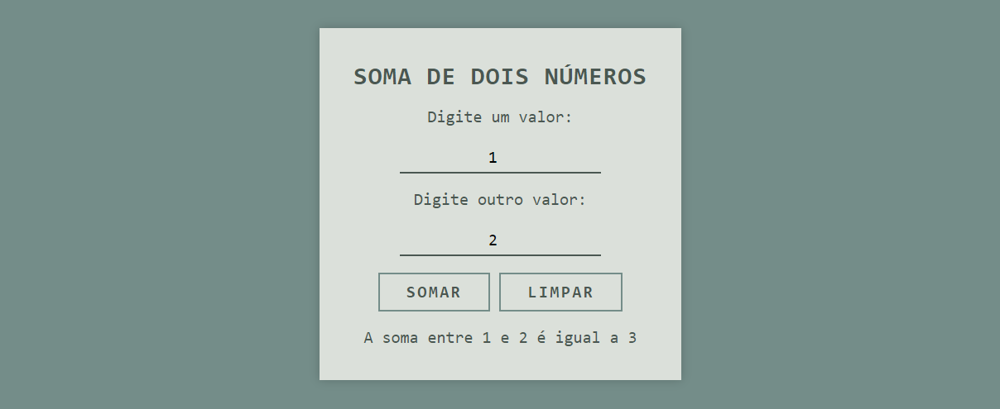
#### 005
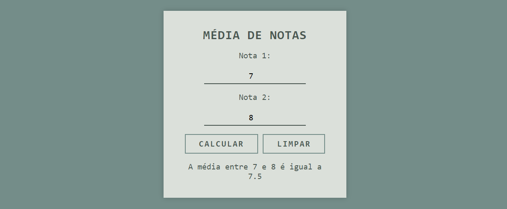
#### 006

#### 007

#### 008
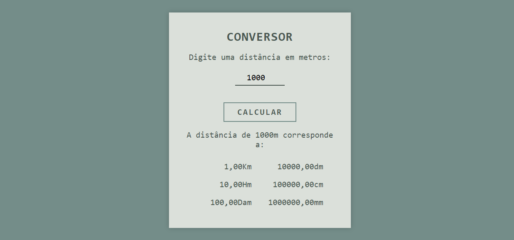
#### 009

#### 010
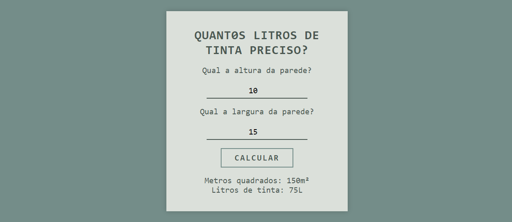
#### 011
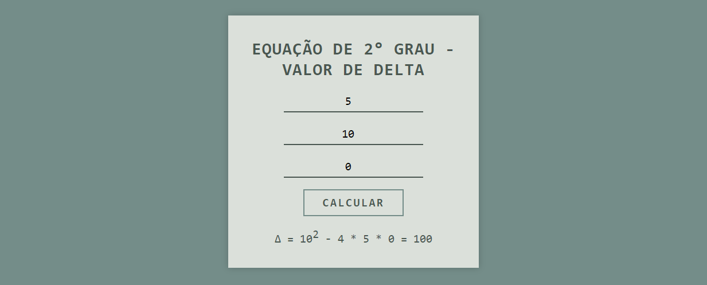
#### 012

#### 013

#### 014
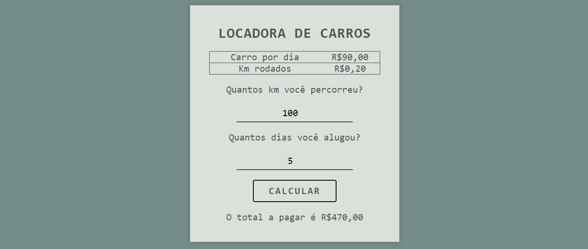
#### 015

#### 016
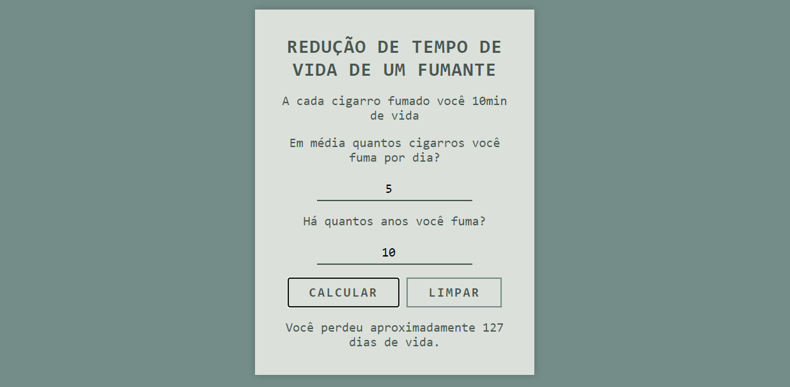

### PASSO-02
#### 017
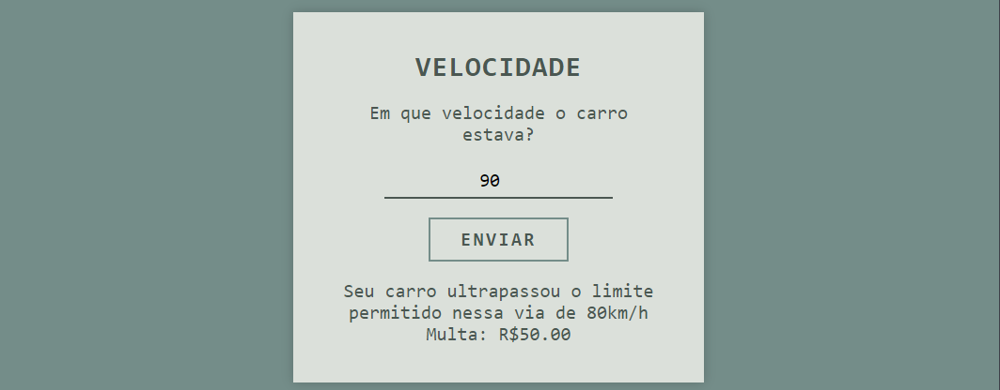
#### 018

#### 019
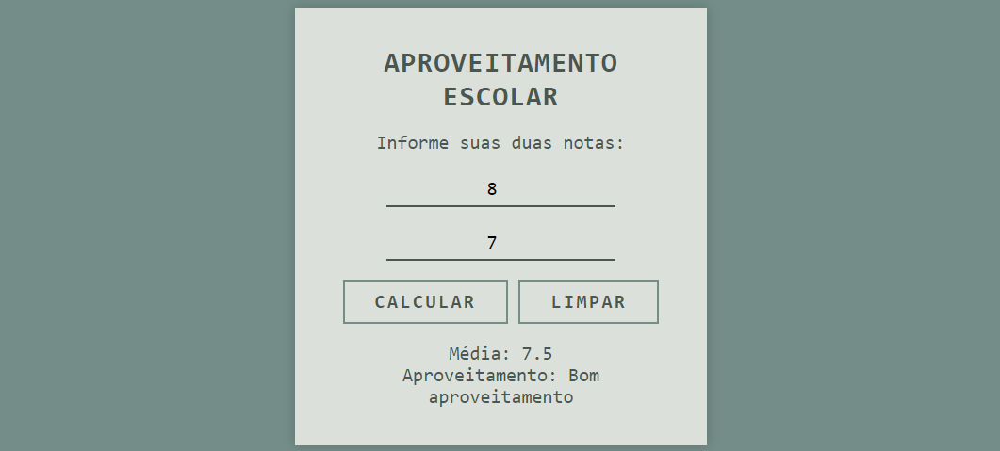
#### 020

#### 021

#### 022

#### 023
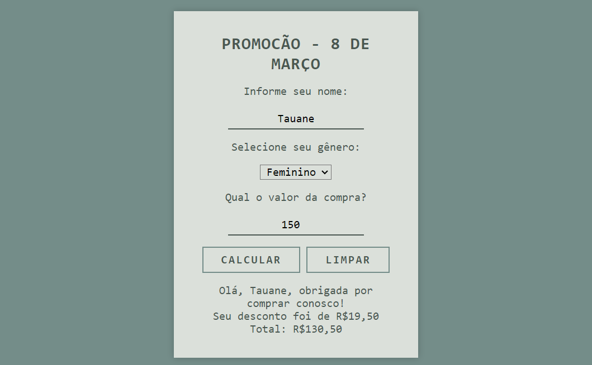
#### 024

#### 025
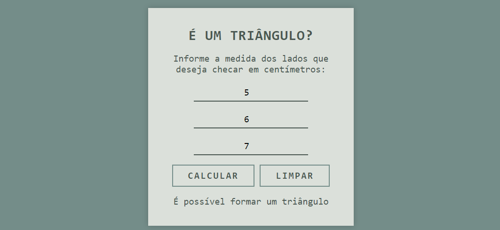

### PASSO-03
#### 026
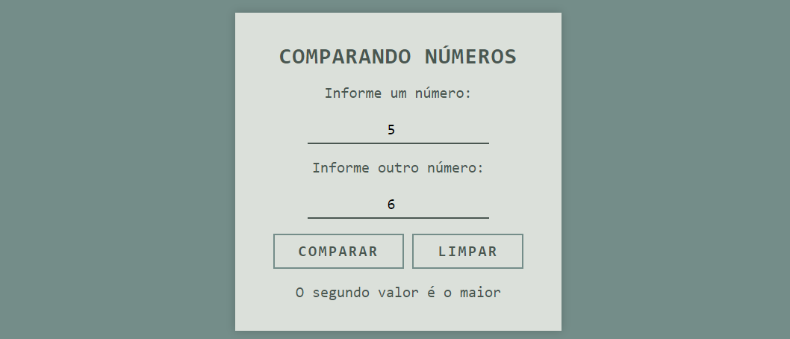
#### 027
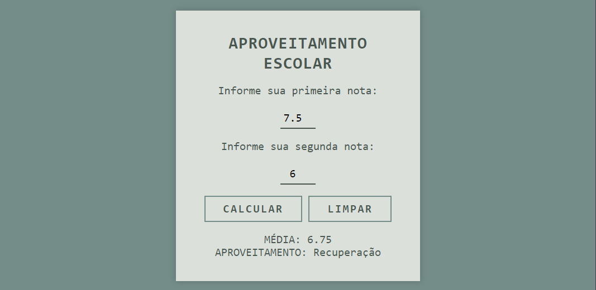
#### 028
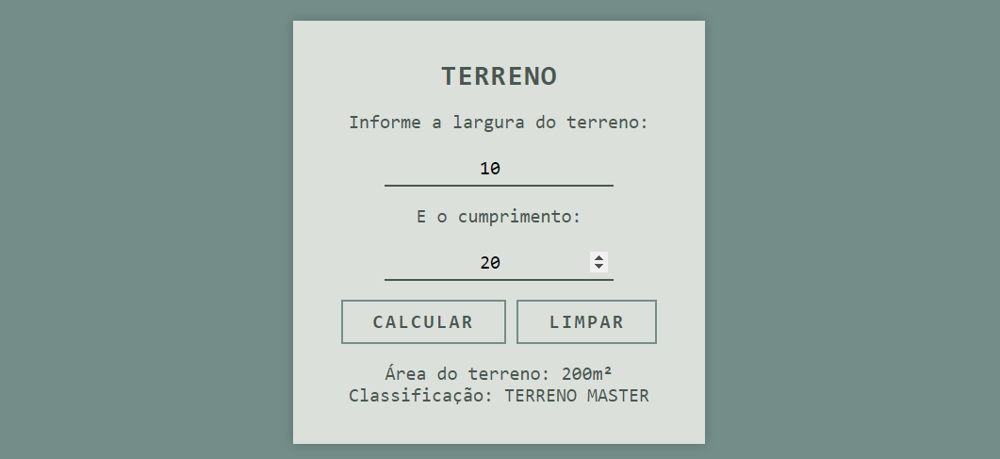
#### 029
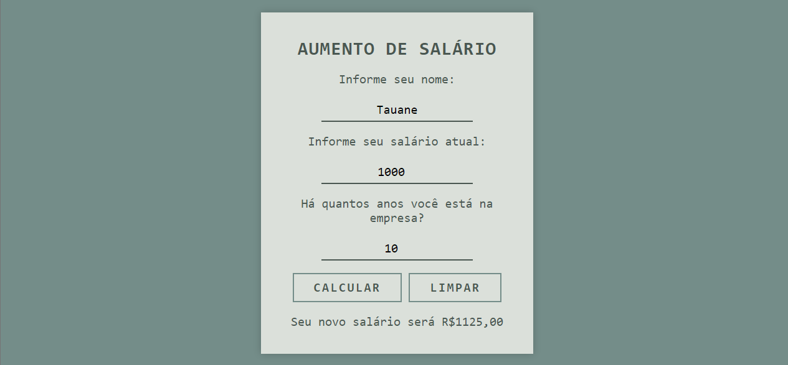
#### 030
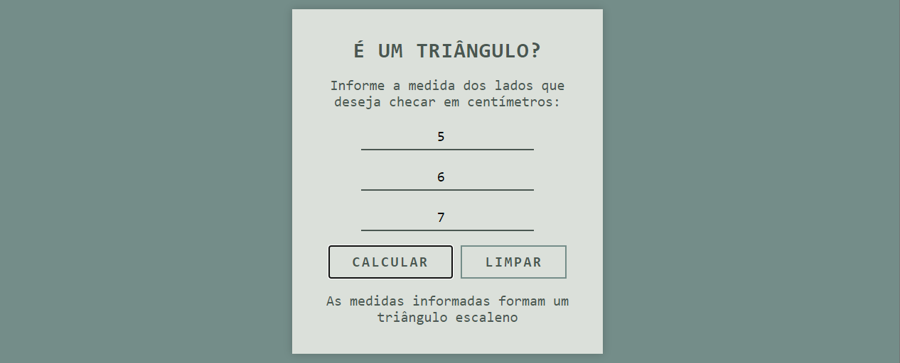
#### 031

#### 032

#### 033
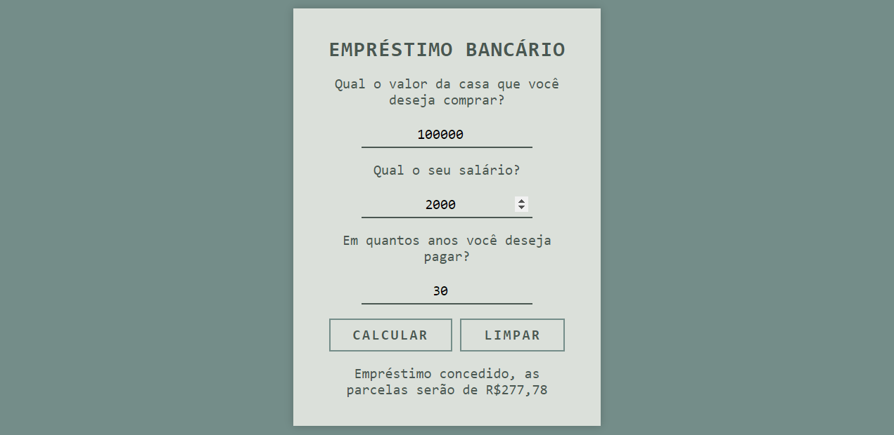
#### 034
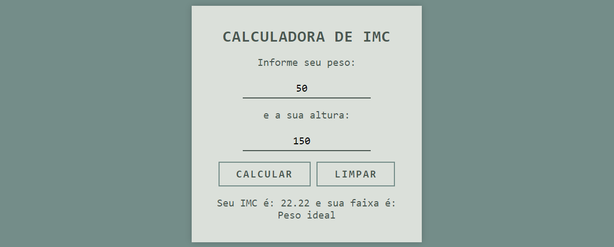
#### 035
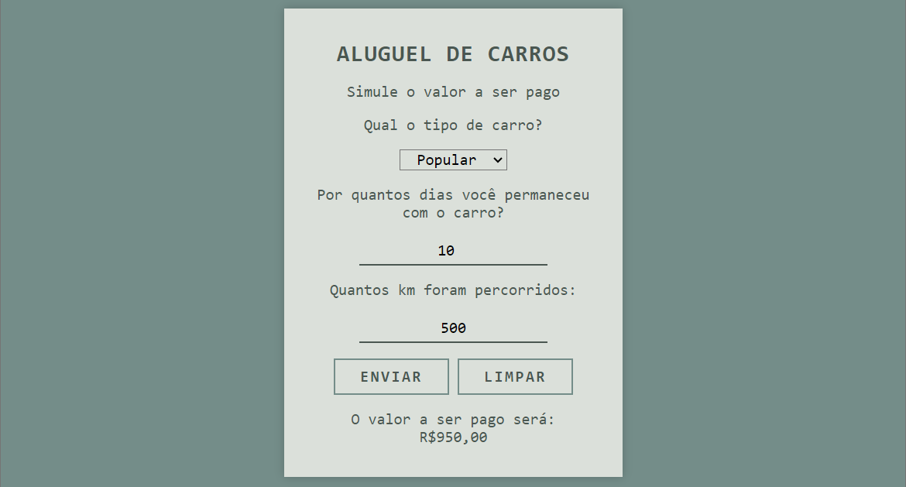
#### 036
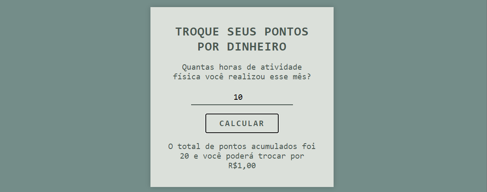
#### 037
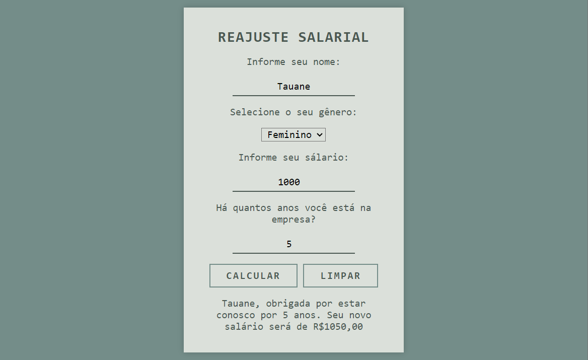

### PASSO-04
#### 038

#### 039
